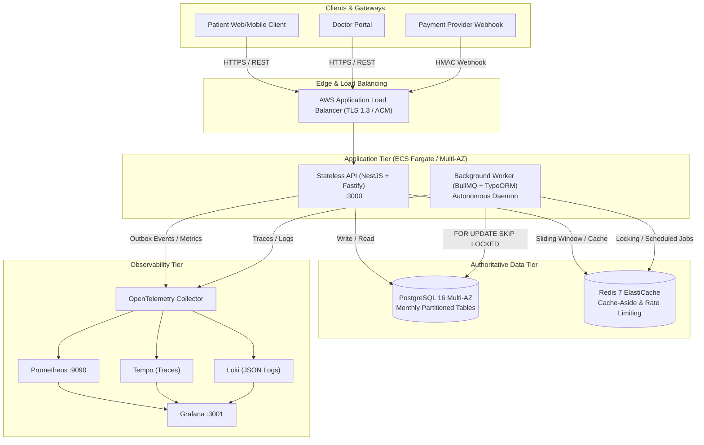
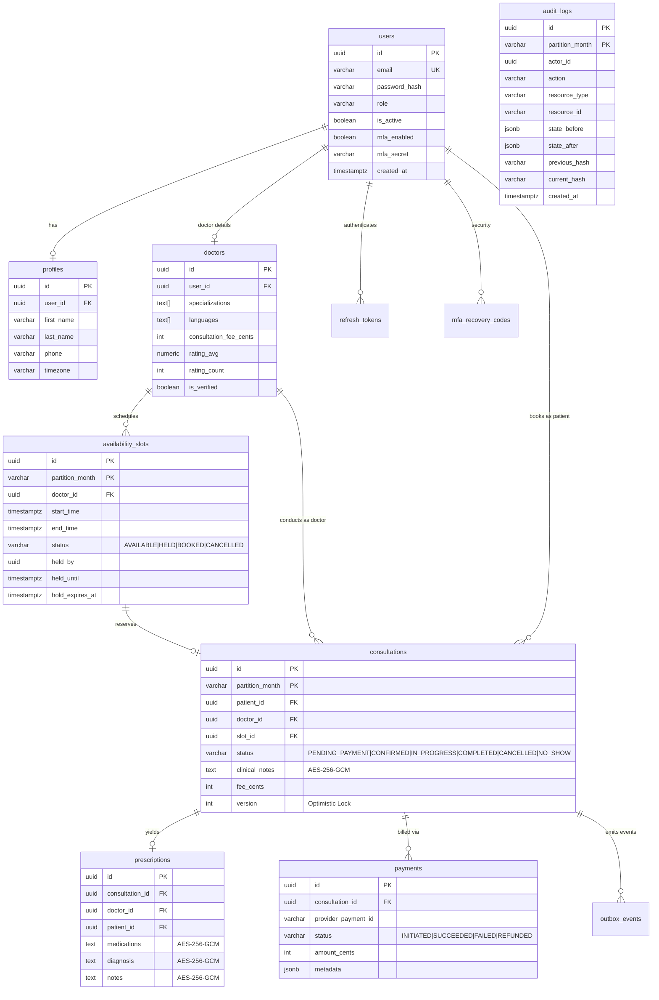
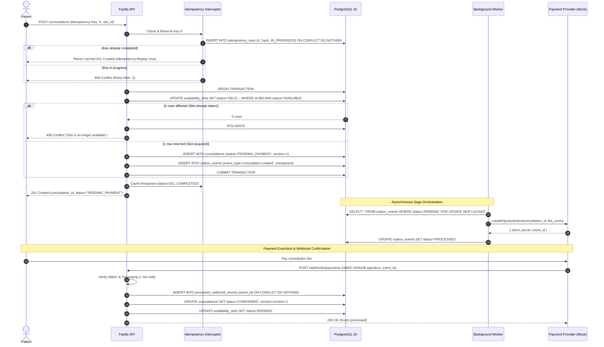
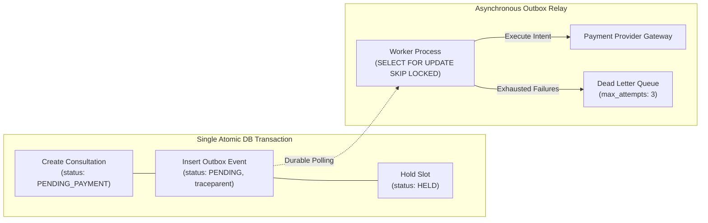

# Amrutam Telemedicine Backend: Architecture Specification

## 1. Context & High-Level System Architecture

Amrutam is a production-grade telemedicine backend engineered to process **100,000 daily consultations** (~300 peak RPS) with a **99.95% availability SLO**, **p95 read latency < 200 ms**, and **p95 write latency < 500 ms**. The system enforces zero double-booking under extreme concurrency, strict cryptographic protection of Protected Health Information (PHI), and tamper-evident audit trails.

The system is designed as a **modular monolith** packaged into a single codebase with two specialized runtime entrypoints:
1. **Stateless API (`src/main.ts`)**: NestJS application using the high-performance Fastify adapter. Handles client authentication, doctor availability queries, consultation scheduling, payment webhooks, and administrative analytics.
2. **Background Worker (`src/worker.ts`)**: Autonomous daemon executing transactional outbox event relay, distributed saga compensations, stale hold expirations, partition maintenance, and materialized view refreshes.



---

## 2. Core Data Model & Entity Relationships

The relational schema is implemented in PostgreSQL 16. High-volume tables (`availability_slots`, `consultations`, and `audit_logs`) are **range-partitioned by month** using a deterministic `partition_month` column (`VARCHAR(7)`, e.g., `'2026-09'`). Composite primary keys `(id, partition_month)` satisfy PostgreSQL global uniqueness requirements.



---

## 3. Booking Flow Sequence & Concurrency Handling

Double booking is prevented entirely at the database layer. No slot can be reserved unless an atomic conditional `UPDATE` succeeds. Application-level Redis locks are intentionally **not** the source of truth for availability.

### Concurrency Guarantees
1. **Advisory Lock**: A PostgreSQL transaction-level advisory lock (`pg_advisory_xact_lock(hashtext('doctor_slot_lock:' || doctor_id))`) serializes slot creation and modification per doctor.
2. **Conditional Atomic State Update**: When a booking request arrives, the slot is reserved using a single SQL query:
   ```sql
   UPDATE availability_slots
   SET status = 'HELD', held_by = $1, held_until = now() + interval '5 minutes',
       hold_expires_at = now() + interval '5 minutes', updated_at = now()
   WHERE id = $2 AND (
     status = 'AVAILABLE' OR 
     (status = 'HELD' AND (hold_expires_at < now() OR held_until < now()))
   )
   RETURNING id, partition_month, doctor_id, start_time, end_time, status;
   ```
   If 0 rows are returned, the slot has already been claimed or held by another transaction, immediately returning `HTTP 409 Conflict`.
3. **Patient Overlap Check**: In the same transaction, the engine queries whether the patient already has an active hold or confirmed booking overlapping the requested time window.
4. **Short TTL Hold**: Holds automatically expire in 5 minutes. The worker executes `releaseExpiredHolds()` every 10 seconds to free abandoned slots.



---

## 4. API Schema & Idempotency Strategy

The REST API strictly implements RFC 7807 Problem Details (`application/problem+json`) for all client errors and conforms to the OpenAPI 3.0 specification exported to [`docs/openapi.yaml`](file:///D:/backend/backend/docs/openapi.yaml).

### Key Endpoints
- **Auth**: `POST /auth/register`, `POST /auth/login` (step 1), `POST /auth/mfa/verify` (step 2), `POST /auth/refresh`, `POST /auth/logout`.
- **Availability**: `POST /availability/slots` (doctor single/bulk), `DELETE /availability/slots/:id` (doctor cancellation), `GET /availability/doctors/:id/slots` (public view).
- **Consultations**: `POST /consultations` (patient booking), `GET /consultations/:id` (ownership checked), `PATCH /consultations/:id/start`, `PATCH /consultations/:id/complete`, `PATCH /consultations/:id/cancel`, `PATCH /consultations/:id/no-show`.
- **Prescriptions**: `POST /consultations/:id/prescriptions` (assigned doctor only), `GET /consultations/:id/prescriptions` (assigned doctor or patient).
- **Search & Admin**: `GET /search/doctors` (full-text + filters + keyset pagination), `GET /admin/analytics/consultations`, `GET /admin/audit-logs`.

### Idempotency Control Mechanism
Every mutating request requires an `Idempotency-Key` header.
- **Payload Validation**: The SHA-256 hash of the request body is computed upon receipt. If an existing record with the same `(user_id, endpoint, idempotency_key)` has a differing body hash, the interceptor rejects the call with `HTTP 422 Unprocessable Entity`.
- **Atomic Reservation**: The key is registered via `INSERT INTO idempotency_keys ... ON CONFLICT DO NOTHING`. If the key is already `IN_PROGRESS`, `HTTP 409 Conflict` is returned with `Retry-After: 2`.
- **Response Replay**: Once the operation completes, status is updated to `COMPLETED` and the HTTP status and body are cached. Future replays return the cached response with the HTTP header `Idempotency-Replay: true`.
- **Crash Recovery**: If an operation crashes mid-flight, keys stuck in `IN_PROGRESS` for > 60 seconds are automatically released for retry.

---

## 5. Data Partitioning & Full-Text Search

### PostgreSQL Range Partitioning
`availability_slots`, `consultations`, and `audit_logs` are partitioned by month on `partition_month` (`VARCHAR(7)`).
- **Boundary Optimization**: Queries include `partition_month = to_char(start_time, 'YYYY-MM')` in `WHERE` clauses, enabling the PostgreSQL query planner to perform static **partition pruning** and avoid scanning inactive tables.
- **Partition Lifecycle Automation**: The database function `ensure_partitions(months_ahead INT)` generates future tables up to 3 months ahead. A recurring BullMQ worker job runs this daily. A `DEFAULT` partition catches anomalies.

### Search Architecture & Cache-Aside
Doctor search is executed over PostgreSQL full-text search (`tsvector` + GIN) with trigram (`pg_trgm`) similarity fallback:
```sql
SELECT d.*, p.first_name, p.last_name,
       ts_rank_cd(d.search_vector, plainto_tsquery('english', $1)) AS rank
FROM doctors d
JOIN profiles p ON p.user_id = d.user_id
WHERE d.search_vector @@ plainto_tsquery('english', $1)
   OR similarity(p.first_name || ' ' || p.last_name, $1) > 0.2
ORDER BY rank DESC, d.rating_avg DESC
LIMIT 20;
```
- **Redis Cache-Aside**: Search queries and doctor profiles are cached using normalized query hashes (`search:doctors:v{version}:{hash}`).
- **Cache Invalidation**: Profile and slot updates increment a per-namespace version counter in Redis (`INCR version:doctors:search`), instantaneously invalidating cached searches without expensive `KEYS` or `SCAN` operations.
- **Stampede Protection**: Cache misses acquire a short-lived single-flight Redis lock (`SET lock:key token NX PX 5000`). Concurrent requests await lock release, preventing database stampedes.

---

## 6. Transaction Management, Outbox & Saga

Cross-service data consistency between PostgreSQL and external gateways is orchestrated using the **Transactional Outbox** pattern:



1. **Atomic Enqueue**: Business mutations and event creation occur inside the same ACID transaction. No message is emitted unless the database commit succeeds.
2. **Contention-Free Polling**: Workers poll pending events using `SELECT ... FOR UPDATE SKIP LOCKED`. Multiple worker instances process distinct outbox records concurrently with zero row lock contention.
3. **Trace Context Propagation**: W3C `traceparent` headers are captured and persisted in the `outbox_events` table, maintaining an unbroken distributed trace between API ingress and background job execution.
4. **Resilience & Backoff**: Outbound payment calls are wrapped in a **Circuit Breaker** (`CLOSED`, `OPEN`, `HALF_OPEN`) with exponential backoff and full jitter:
   $$\Delta t = \min(t_{\max}, t_{\text{base}} \times 2^{\text{attempt}}) \times \text{random}(0, 1)$$
5. **Dead Letter Queue (DLQ)**: Events exceeding 3 failed attempts transition to `FAILED` status, triggering a critical Prometheus alert.
6. **Compensating Transactions**: If payment expires (> 10 minutes) or fails permanently, the saga compensates by transitioning the consultation to `CANCELLED`, restoring the slot to `AVAILABLE`, and logging the compensation to `audit_logs`.

---

## 7. Reliability, Backup & Disaster Recovery

| Dimension | Target | Strategy & Implementation |
| :--- | :--- | :--- |
| **RPO** (Recovery Point Objective) | **< 5 minutes** | PostgreSQL continuous Write-Ahead Log (WAL) archiving to S3, 14-day Point-in-Time Recovery (PITR) via AWS RDS. |
| **RTO** (Recovery Time Objective) | **< 30 minutes** | RDS Multi-AZ automatic failover (< 2 min); infrastructure reprovisioning via modular Terraform configurations. |
| **High Availability** | **99.95%** | Redundant ECS Fargate tasks across 3 Availability Zones (`ap-south-1a/b/c`), Multi-AZ ElastiCache Redis, ALB health checks. |
| **Cache Loss Tolerance** | **Zero Data Loss** | Redis operates strictly as a rebuildable cache. No authoritative application state resides exclusively in Redis. |

---

## 8. Scalability Path & Architectural Trade-Offs

### Scalability Roadmap
1. **Database Read Replicas**: Direct read-only traffic (`GET /search/doctors`, `GET /availability/*`, analytics) to RDS read replicas using TypeORM replication pools, reserving the primary instance exclusively for write transactions.
2. **Selective Microservice Extraction**: The bounded contexts (`auth`, `search`, `payments`, `consultations`) share zero direct cross-module foreign key constraints outside the database boundary. If organization scale demands independent deployments, `payments` and `search` can be extracted into standalone services communicating over Kafka/RabbitMQ.
3. **Distributed Job Scaling**: Background workers scale horizontally across Fargate tasks via BullMQ consumer groups partitioned by queue topic.

### Key Architectural Trade-Offs

| Decision | Trade-Off Accepted | Rationale |
| :--- | :--- | :--- |
| **Modular Monolith vs Microservices** | Shared deployment artifact and relational transactions over independent service lifecycles. | Eliminates distributed transaction failures (two-phase commit), avoids network latency on core workflows, and drastically simplifies local verification and CI. |
| **DB Atomic Update vs Redis Locks** | Direct write load on PostgreSQL primary rather than ultra-fast Redis memory locks. | Guarantees absolute consistency. Redis locks can become stale or partitioned during failover; PostgreSQL conditional updates guarantee zero double-booking under any failure scenario. |
| **Outbox Table Polling vs Change Data Capture (Debezium)** | Polling overhead (`SKIP LOCKED` every 500ms) over event-driven CDC log streaming. | Eliminates heavy Kafka/Zookeeper/Debezium infrastructure dependencies. Database benchmark shows `SKIP LOCKED` uses < 1% CPU at target throughput. |
| **Field-Level AES-256-GCM vs Transparent Data Encryption (TDE)** | Application CPU overhead for crypto operations over storage-level encryption only. | TDE does not protect against privileged DB administrators or SQL injection exfiltration. Field-level encryption ensures PHI remains ciphertext even during database dumps. |
