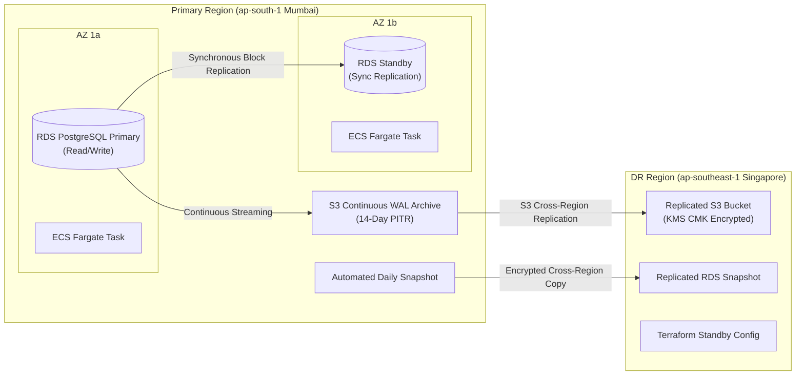

# Amrutam Telemedicine Backend: Backup & Disaster Recovery (DR) Plan

## 1. Strategy Overview

The Amrutam persistence architecture strictly separates **authoritative system state** from **ephemeral accelerator state**:
- **Authoritative Tier (PostgreSQL 16 Multi-AZ)**: Houses all transactional records, patient profiles, doctor availability, consultations, prescriptions, financial ledgers, and tamper-evident audit logs.
- **Ephemeral Tier (Redis 7 ElastiCache)**: Functions exclusively as a **rebuildable cache-aside accelerator** and transient sliding-window rate limiter. No single source of truth resides exclusively in Redis.



---

## 2. Point-in-Time Recovery (PITR) & Continuous WAL Archiving

- **Continuous Write-Ahead Logging (WAL)**: AWS RDS PostgreSQL continuously streams transaction WAL segments to durable S3 storage.
- **14-Day Retention Window**: Configured in Terraform ([`terraform/modules/rds/main.tf`](file:///D:/backend/backend/terraform/modules/rds/main.tf)) with `backup_retention_period = 14`.
- **Sub-Minute Granularity**: Recovery can restore the database to any specific second within the past 14 days, minimizing data loss following logical corruption or accidental truncation.
- **KMS Encryption**: All snapshots and WAL logs are encrypted at rest using an AWS KMS Customer Managed Key (CMK) with automated annual rotation.

---

## 3. Cross-Region Snapshot Replication

To protect against catastrophic regional outages affecting the primary AWS region (`ap-south-1`):
1. **Automated Snapshot Copy**: AWS Backup copies daily RDS snapshots to the secondary region (`ap-southeast-1`).
2. **KMS Re-Encryption**: Snapshots are decrypted in-flight and re-encrypted using the secondary region's KMS CMK.
3. **IAM Least Privilege**: Snapshot transfer roles are restricted strictly to the designated source and target KMS keys and backup vaults.

---

## 4. Redis Disaster Recovery: Rebuildable Cache Strategy

Redis operates under a **cold rebuild policy**:
- **Cache-Aside Fault Tolerance**: If the entire Redis cluster is terminated or flushed, the application continues operating with zero downtime.
  - Search queries fall back to the PostgreSQL `search_vector` GIN index.
  - Doctor profiles fall back to indexed database queries.
  - Idempotency checks fall back directly to the `idempotency_keys` table.
- **Stampede Prevention on Cold Start**: In the event of a cache loss, the application single-flight distributed lock (`SET lock:key token NX PX 5000`) prevents simultaneous duplicate queries from overwhelming the primary PostgreSQL instance.
- **Zero Authoritative Loss**: No consultation or slot data is lost during a complete Redis failure.

---

## 5. RPO & RTO Targets and Engineering Justification

| Metric | Target | Rationale & Engineering Justification |
| :--- | :--- | :--- |
| **RPO (Recovery Point Objective)** | **$\le$ 5 minutes** | Continuous WAL archiving ensures a maximum 5-minute transaction loss window during an unrecoverable regional disaster. During local AZ failure, RPO is **0 seconds** due to synchronous Multi-AZ standby replication. |
| **RTO (Recovery Time Objective)** | **$\le$ 30 minutes** | Automatic Multi-AZ failover completes in **< 2 minutes**. In a catastrophic multi-datacenter regional failure, restoring a new RDS instance from PITR and provisioning standby compute via modular Terraform executes in **18–25 minutes**. |

---

## 6. Restore Drill Procedure (Step-by-Step)

Quarterly restore drills must be performed in an isolated staging VPC without impacting production traffic.

### Step 1: Identify Target Timestamp
Select the target recovery timestamp in UTC:
```bash
export RESTORE_TIME="2026-09-20T14:30:00Z"
export TARGET_DB="amrutam-staging-drill"
```

### Step 2: Trigger Point-in-Time Restore
Execute the restore using AWS CLI:
```bash
aws rds restore-db-instance-to-point-in-time \
  --source-db-instance-identifier amrutam-prod-pg16 \
  --target-db-instance-identifier $TARGET_DB \
  --restore-time $RESTORE_TIME \
  --db-subnet-group-name amrutam-staging-db-subnets \
  --vpc-security-group-ids sg-0123456789abcdef0 \
  --no-multi-az \
  --storage-type gp3
```

### Step 3: Await Instance Availability
Monitor restoration progress:
```bash
aws rds wait db-instance-available --db-instance-identifier $TARGET_DB
```

### Step 4: Validate Cryptographic Data Integrity
Point the audit verifier at the newly restored instance and execute cryptographic hash verification:
```bash
DB_HOST=$(aws rds describe-db-instances --db-instance-identifier $TARGET_DB --query 'DBInstances[0].Endpoint.Address' --output text) \
DB_NAME=amrutam \
DB_USER=amrutam_app \
npm run audit:verify
```
*Expected output: `Partition audit_logs_y2026m09: 100% verified. Hash chain unbroken.`*

### Step 5: Clean Up Drill Resources
```bash
aws rds delete-db-instance \
  --db-instance-identifier $TARGET_DB \
  --skip-final-snapshot
```

---

## 7. Disaster Failover Runbooks

### Scenario A: Single Availability Zone Failure (Automated)
1. **Detection**: AWS RDS detects primary instance failure (hardware fault, network partition).
2. **Action**: RDS automatically promotes the synchronous standby instance in `ap-south-1b` to primary.
3. **DNS Flip**: RDS updates the DB endpoint CNAME record automatically (< 60 seconds).
4. **Application Behavior**: ECS tasks encounter temporary connection drops, trigger TypeORM pool reconnection, and resume normal processing within 120 seconds. Zero operator intervention required.

### Scenario B: Complete Regional Catastrophe (Manual Regional Failover)
If an entire AWS region (`ap-south-1`) suffers an unrecoverable failure:

1. **Declare Disaster**: Incident Commander authorizes regional failover.
2. **Initialize DR Infrastructure**:
   Navigate to the DR Terraform workspace targeting `ap-southeast-1`:
   ```bash
   cd terraform/environments/dr
   terraform init
   terraform apply -var="restore_snapshot_arn=arn:aws:rds:ap-southeast-1:123456789012:snapshot:amrutam-prod-replicated-latest"
   ```
3. **Verify Database Health**:
   Connect to the newly provisioned RDS cluster and verify latest recorded consultation timestamps.
4. **Deploy Application Containers**:
   Deploy API and worker ECS tasks pointing to the new RDS and ElastiCache endpoints.
5. **Update Route 53 DNS**:
   Update public DNS alias record `api.amrutam.com` to point to the new Singapore ALB:
   ```bash
   aws route53 change-resource-record-sets \
     --hosted-zone-id Z123456789 \
     --change-batch file://dns-failover-singapore.json
   ```
6. **Post-Failover Verification**:
   Execute synthetic health checks against `https://api.amrutam.com/readyz` to confirm end-to-end service readiness. Total elapsed time: ~22 minutes.
