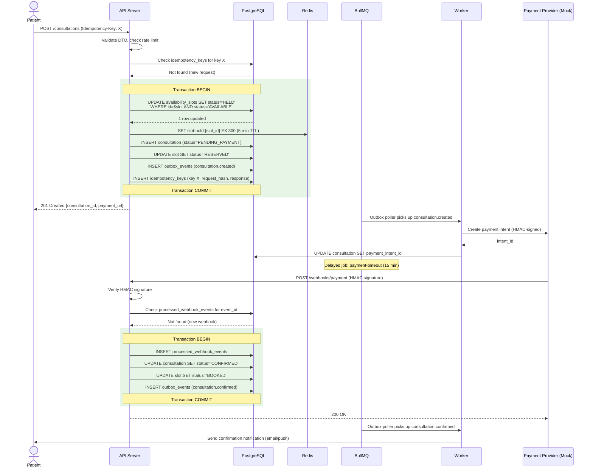
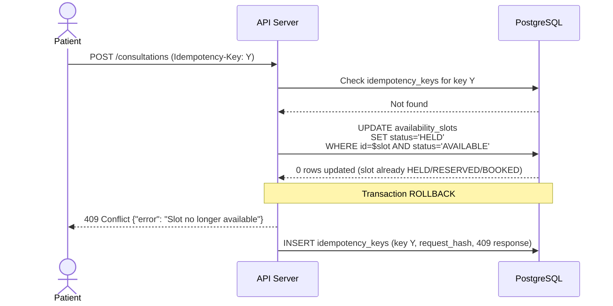
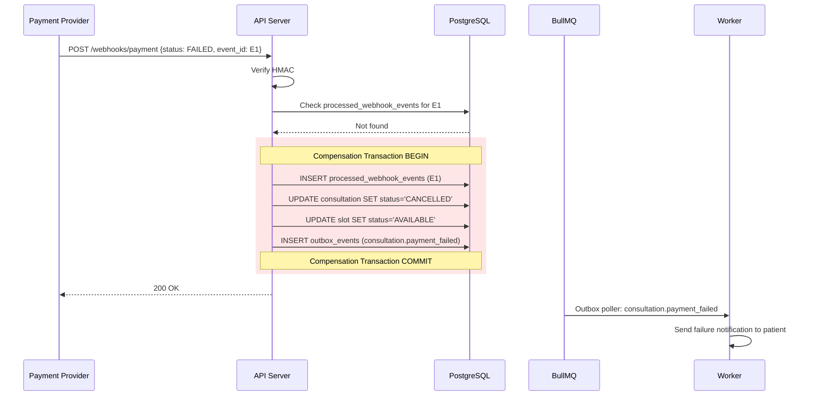
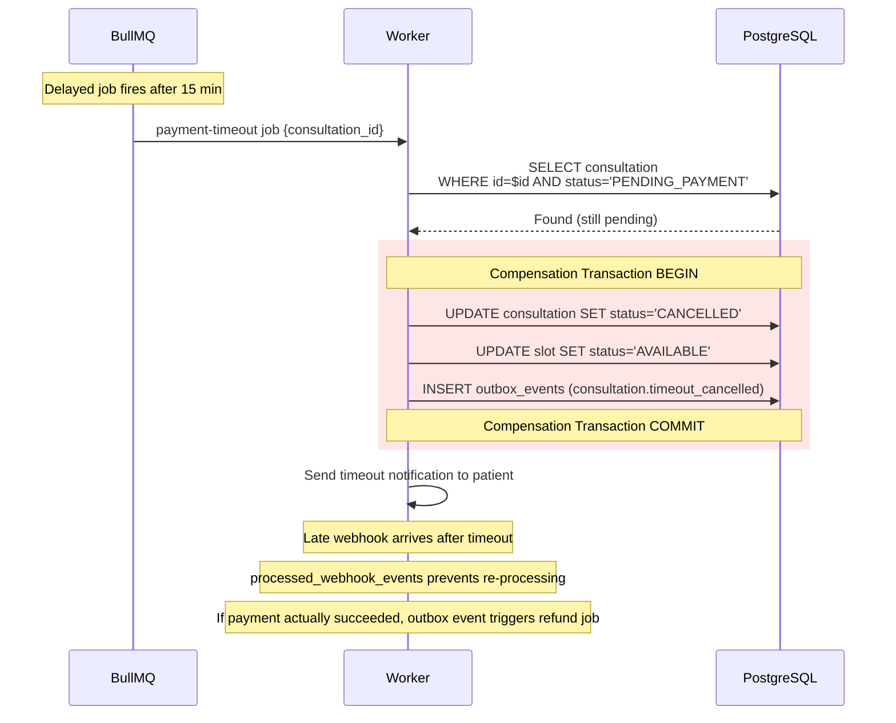
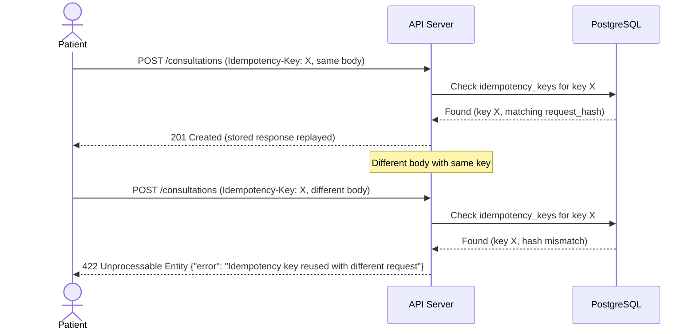
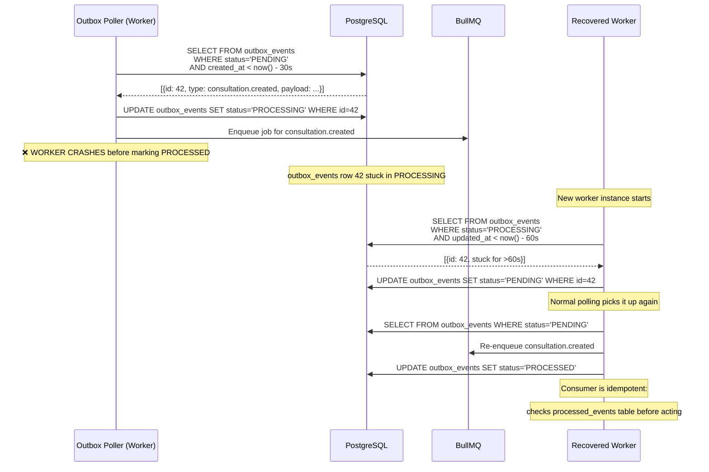

# Booking Sequence Diagram

Happy path and all failure paths for the booking → payment → confirmation saga.

## Happy Path

## Failure Path 1: Slot Conflict (Double Booking Attempt)

## Failure Path 2: Payment Failure (Webhook: status=FAILED)

## Failure Path 3: Payment Timeout (No Webhook Within 15 Minutes)

## Failure Path 4: Duplicate Request (Same Idempotency-Key)

## Failure Path 5: Worker Crash Mid-Outbox Relay

