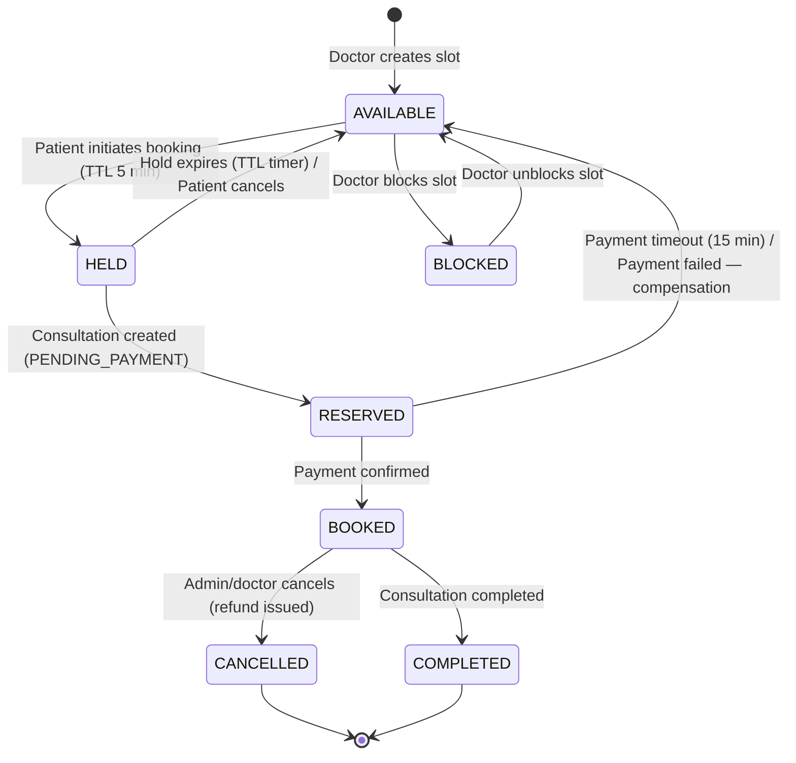
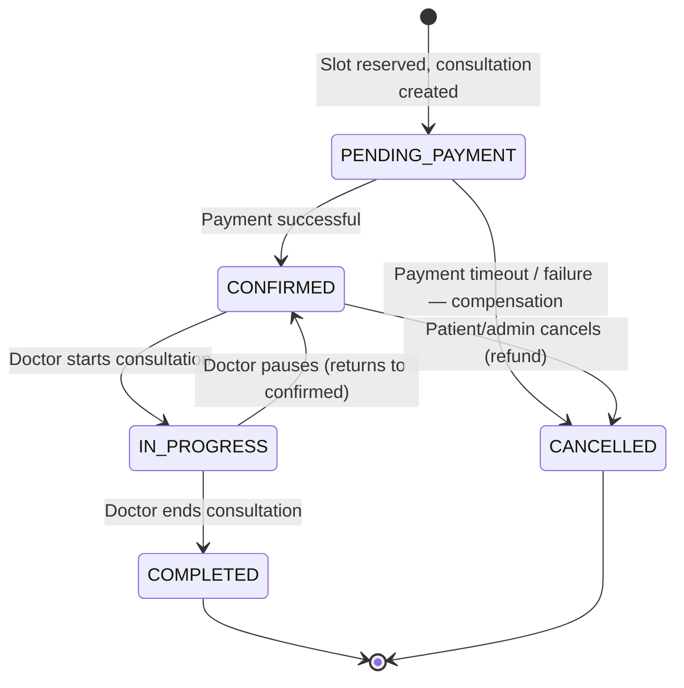

# State Machines

## 1. Availability Slot States

### Slot Transition Table

| From | To | Trigger | Guard | Compensation on Failure |
|------|-----|---------|-------|------------------------|
| — | AVAILABLE | Doctor creates slot via API | Slot doesn't overlap existing | — |
| AVAILABLE | HELD | `POST /consultations` (booking initiation) | Conditional UPDATE `SET status='HELD' WHERE status='AVAILABLE'` returns 1 row | — |
| HELD | AVAILABLE | TTL expiry (Redis key + BullMQ delayed job) | Slot still HELD | — |
| HELD | AVAILABLE | Patient cancels hold | Actor is the hold owner | — |
| HELD | RESERVED | Consultation record created with `PENDING_PAYMENT` | Inside same DB transaction as consultation INSERT | Release slot to AVAILABLE |
| RESERVED | AVAILABLE | Payment timeout (15 min BullMQ delayed job) | Slot still RESERVED | Cancel consultation → CANCELLED |
| RESERVED | AVAILABLE | Payment provider returns failure webhook | Slot still RESERVED | Cancel consultation → CANCELLED |
| RESERVED | BOOKED | Payment confirmed (webhook) | Valid HMAC, slot still RESERVED | — |
| BOOKED | CANCELLED | Doctor/admin cancels | RBAC: doctor owner or admin | Initiate refund |
| BOOKED | COMPLETED | Consultation marked complete | Doctor is consultation owner | — |
| AVAILABLE | BLOCKED | Doctor blocks time | Doctor owns slot | — |
| BLOCKED | AVAILABLE | Doctor unblocks | Doctor owns slot | — |

### Concurrency Protection

- **DB-level**: `UPDATE availability_slots SET status = 'HELD', held_by = $patient_id, held_until = now() + interval '5 minutes' WHERE id = $slot_id AND partition_month = $month AND status = 'AVAILABLE'` — returns 0 rows on conflict → 409 Conflict.
- **No Redis source of truth**: Redis holds a TTL key `slot-hold:{slot_id}` only as a fast-expiry trigger for the BullMQ cleanup job. The DB `held_until` column is authoritative.
- **Unique constraint**: `UNIQUE(slot_id, slot_partition_month, partition_month) WHERE status NOT IN ('CANCELLED')` on consultations prevents double-booking at the DB level as a second line of defense.

---

## 2. Consultation States

### Consultation Transition Table

| From | To | Trigger | Guard | Side Effects |
|------|-----|---------|-------|--------------|
| — | PENDING_PAYMENT | Booking saga: slot HELD→RESERVED | Valid held slot, patient exists | Outbox event: `consultation.created` |
| PENDING_PAYMENT | CONFIRMED | Payment webhook (status=SUCCESS) | Valid HMAC, idempotent (processed_webhook_events) | Slot → BOOKED, outbox: `consultation.confirmed` |
| PENDING_PAYMENT | CANCELLED | Payment timeout (15 min) | BullMQ delayed job fires | Slot → AVAILABLE, outbox: `consultation.cancelled` |
| PENDING_PAYMENT | CANCELLED | Payment webhook (status=FAILED) | Valid HMAC | Slot → AVAILABLE, outbox: `consultation.payment_failed` |
| CONFIRMED | IN_PROGRESS | Doctor starts | Doctor is consultation owner, within scheduled time | Outbox: `consultation.started` |
| IN_PROGRESS | COMPLETED | Doctor ends consultation | Doctor is owner | Outbox: `consultation.completed`, slot → COMPLETED |
| IN_PROGRESS | CONFIRMED | Doctor pauses | Doctor is owner | — |
| CONFIRMED | CANCELLED | Patient or admin cancels | Patient is owner OR admin role; cancellation policy window | Slot → CANCELLED, initiate refund, outbox: `consultation.cancelled` |

### Compensation Summary

| Failure Scenario | Compensation Steps |
|-----------------|------|
| Payment timeout (15 min) | 1. Set consultation → CANCELLED, 2. Set slot → AVAILABLE, 3. Emit `consultation.cancelled` via outbox |
| Payment provider failure | 1. Set consultation → CANCELLED, 2. Set slot → AVAILABLE, 3. Emit `consultation.payment_failed` via outbox |
| Worker crash mid-outbox relay | Outbox poller re-reads unprocessed events (status=PENDING, created > 30s ago). Events are idempotent (consumers check `processed_events` table). At-least-once delivery, exactly-once processing. |
| Slot hold expires but consultation already created | BullMQ job checks: if consultation exists in PENDING_PAYMENT and slot is RESERVED, treat as payment-timeout path. If consultation is already CONFIRMED, no-op. |
| Double webhook delivery | `processed_webhook_events` table with UNIQUE on `(provider, event_id)`. Second insert fails → return stored response. |
