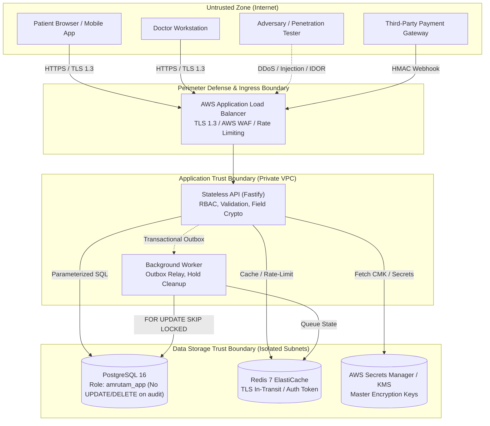

# Amrutam Telemedicine Backend: Threat Model & Security Architecture

## 1. System Context & Trust Boundaries

The Amrutam telemedicine platform processes sensitive electronic Protected Health Information (ePHI), personally identifiable information (PII), and financial transactions. This threat model applies the STRIDE methodology across all components and data flows.

### Trust Boundary Definitions
1. **Perimeter Boundary (TB-1)**: Separates external internet traffic from the cloud infrastructure. Enforced by the Application Load Balancer terminating TLS 1.3 with standard cipher suites (`ELBSecurityPolicy-TLS13-1-2-2021-06`).
2. **Application Boundary (TB-2)**: Separates reverse proxies from containerized NestJS applications in private ECS subnets. All inputs undergo strict DTO validation (`class-validator` with whitelist and non-whitelisted rejection).
3. **Data Storage Boundary (TB-3)**: Separates compute containers from persistent storage. PostgreSQL and Redis operate inside non-routable private subnets accessible only via security groups restricted to the ECS application security group.
4. **Third-Party Integration Boundary (TB-4)**: Separates internal services from external payment gateways. Outbound calls use timeouts and circuit breakers; inbound webhooks enforce timing-safe HMAC signature verification.

---

## 2. Asset Inventory & Criticality

| Asset ID | Asset Description | Sensitivity Classification | Protection Requirements |
| :--- | :--- | :--- | :--- |
| **AST-01** | Clinical Notes & Diagnoses | **PHI (Confidential)** | AES-256-GCM field encryption, zero logging, access audited. |
| **AST-02** | Prescription Medication Details | **PHI (Confidential)** | AES-256-GCM field encryption, assigned doctor/patient read only. |
| **AST-03** | User Passwords & TOTP Secrets | **Critical Authentication** | Argon2id hashing for passwords; AES-256-GCM for TOTP secrets. |
| **AST-04** | JWT Signing & Encryption Keys | **Critical Cryptographic** | 256-bit entropy, injected via environment/Secrets Manager. |
| **AST-05** | Audit Logs & Compliance Trails | **System Integrity** | Append-only DB role permissions, cryptographic SHA-256 hash chain. |
| **AST-06** | Payment Webhook Secrets | **Financial Integrity** | Timing-safe HMAC verification, timestamp replay tolerance. |

---

## 3. Attack Surface Analysis

1. **Public Authentication Endpoints (`/auth/*`)**: Targeted by credential stuffing, brute force, user enumeration, and MFA bypass attempts.
2. **Booking & Consultation Endpoints (`/consultations/*`, `/availability/*`)**: Targeted by race condition exploits (double booking), denial-of-inventory (slot hoarding), and IDOR data leakage.
3. **Clinical Documentation Endpoints (`/consultations/:id/prescriptions`)**: High-value target for unauthorized PHI exfiltration and doctor impersonation.
4. **Payment Inbound Webhook (`/webhooks/payments`)**: Targeted by forged payment success events, replay attacks, and payload manipulation.
5. **Admin Analytics & Audit Endpoints (`/admin/*`)**: Targeted for privilege escalation and compliance record tampering.

---

## 4. STRIDE Threat Matrix & Mitigations

| Category | Threat Description | Mitigating Control & Architecture | Implementation File / Artifact |
| :--- | :--- | :--- | :--- |
| **S**poofing | Attacker impersonates an authenticated doctor or patient. | JWT authentication with 15-minute access expiry, argon2id password hashing, rotating refresh tokens with reuse detection family invalidation, mandatory TOTP MFA for doctors/admins. | [`src/auth/auth.service.ts`](file:///D:/backend/backend/src/auth/auth.service.ts) [`src/auth/services/token.service.ts`](file:///D:/backend/backend/src/auth/services/token.service.ts) [`src/auth/services/mfa.service.ts`](file:///D:/backend/backend/src/auth/services/mfa.service.ts) |
| **S**poofing | Malicious actor sends fake payment confirmations. | Webhook HMAC-SHA256 signature verification with `crypto.timingSafeEqual`, 5-minute timestamp anti-replay tolerance window. | [`src/payments/payments.service.ts`](file:///D:/backend/backend/src/payments/payments.service.ts) |
| **T**ampering | Attacker intercepts or modifies consultation records or prescriptions. | Field-level AES-256-GCM encryption with 128-bit authentication tag. Tampering causes authentication tag mismatch and decryption failure. | [`src/common/crypto/encryption.service.ts`](file:///D:/backend/backend/src/common/crypto/encryption.service.ts) [`src/prescriptions/prescriptions.service.ts`](file:///D:/backend/backend/src/prescriptions/prescriptions.service.ts) |
| **T**ampering | Rogue database administrator alters past audit records. | Cryptographic SHA-256 hash chaining (`previous_hash -> current_hash`) partitioned by month; DB role `amrutam_app` has `REVOKE UPDATE, DELETE ON audit_logs`. | [`src/audit/audit.service.ts`](file:///D:/backend/backend/src/audit/audit.service.ts) [`migrations/1700000000004-SearchAnalyticsAudit.ts`](file:///D:/backend/backend/migrations/1700000000004-SearchAnalyticsAudit.ts) |
| **R**epudiation | Doctor denies writing a prescription or patient denies cancelling. | Immutable append-only audit trail logging actor ID, role, action, resource, client IP, request ID, and timestamp on all PHI state mutations. | [`src/audit/audit.service.ts`](file:///D:/backend/backend/src/audit/audit.service.ts) [`src/prescriptions/prescriptions.service.ts`](file:///D:/backend/backend/src/prescriptions/prescriptions.service.ts) |
| **I**nformation Disclosure | Attacker probes `/consultations/:id` to read other patients' records (IDOR). | Strict ownership verification in service layer verifying `patient_id == currentUser.id` or `doctor_id == currentUser.doctorId`. Returns 403 Forbidden. | [`src/consultations/consultations.service.ts`](file:///D:/backend/backend/src/consultations/consultations.service.ts) [`src/prescriptions/prescriptions.service.ts`](file:///D:/backend/backend/src/prescriptions/prescriptions.service.ts) |
| **I**nformation Disclosure | Sensitive fields leaked in application log files or APM traces. | Pino logger configuration with automated PII/PHI redaction paths (`password`, `mfa_secret`, `notes`, `diagnosis`, `medications`, `token`). | [`src/common/logger/logger.config.ts`](file:///D:/backend/backend/src/common/logger/logger.config.ts) |
| **D**enial of Service | Malicious user floods booking endpoint or holds all doctor slots. | Sliding-window Redis rate limiter (stricter 5/min on login, 60/min standard); atomic slot hold with 5-minute TTL; patient overlap check prevents holding multiple concurrent slots. | [`src/common/rate-limit/rate-limit.guard.ts`](file:///D:/backend/backend/src/common/rate-limit/rate-limit.guard.ts) [`src/availability/availability.service.ts`](file:///D:/backend/backend/src/availability/availability.service.ts) |
| **E**levation of Privilege | Patient attempts to access administrative analytics or create doctor slots. | RBAC enforced via `@Roles('admin')` or `@Roles('doctor')` and `RolesGuard`. Role extracted from cryptographically verified JWT payload. | [`src/auth/guards/roles.guard.ts`](file:///D:/backend/backend/src/auth/guards/roles.guard.ts) [`src/admin-analytics/admin-analytics.controller.ts`](file:///D:/backend/backend/src/admin-analytics/admin-analytics.controller.ts) |

---

## 5. In-Depth Abuse Case Analysis

### 1. Slot-Hoarding via Holds
- **Threat**: An adversary rapidly submits booking requests across all available slots for a prominent doctor, placing them into `HELD` status to deny availability to genuine patients without paying.
- **Mitigations**:
  1. **Strict Rate Limiting**: The booking endpoint is throttled by `RateLimitGuard` using Redis sliding-window counters.
  2. **Patient Overlap Validation**: Before acquiring a hold, [`AvailabilityService`](file:///D:/backend/backend/src/availability/availability.service.ts) verifies whether the patient already has an active hold or confirmed booking overlapping the slot window.
  3. **Short TTL Hold with Worker Cleanup**: Holds expire deterministically after 5 minutes. The worker executes `releaseExpiredHolds()` every 10 seconds to restore abandoned slots to `AVAILABLE`.

### 2. Account Enumeration
- **Threat**: An attacker probes registration or login endpoints to harvest registered email addresses based on timing differences or distinct error responses.
- **Mitigations**:
  1. **Constant-Time Argon2id Verification**: When login receives an invalid email, [`AuthService`](file:///D:/backend/backend/src/auth/auth.service.ts) executes a dummy argon2id verification against a static hash to equalize computational timing.
  2. **Uniform Error Messaging**: Authentication failures return identical generic responses (`401 Unauthorized: Invalid credentials`) for non-existent emails and invalid passwords alike.
  3. **Strict Sliding-Window Rate Limits**: Failed login attempts trigger aggressive rate limiting (5 requests per minute per IP).

### 3. Token Theft & Session Hijacking
- **Threat**: An attacker intercepts an access token or steals a refresh token from local storage.
- **Mitigations**:
  1. **Short-Lived Access Tokens**: JWT access tokens expire after 15 minutes.
  2. **Hashed Refresh Tokens**: Refresh tokens are stored in the database as SHA-256 hashes (`refresh_tokens.token_hash`), preventing theft via database read access.
  3. **Token Rotation & Family Invalidation**: Every refresh token issuance invalidates the prior token. If a previously used refresh token is presented, [`TokenService`](file:///D:/backend/backend/src/auth/services/token.service.ts) flags reuse and immediately revokes all tokens in the user's token family.

### 4. Webhook Forgery & Replay Attacks
- **Threat**: An attacker sends forged `POST /webhooks/payments` events to mark consultations as `CONFIRMED` without paying, or replays intercepted valid webhooks.
- **Mitigations**:
  1. **Timing-Safe HMAC Verification**: Computes HMAC-SHA256 signature using `PAYMENT_WEBHOOK_SECRET` and validates against the incoming header using `crypto.timingSafeEqual` to prevent timing side-channel attacks.
  2. **Timestamp Anti-Replay Window**: Inbound webhooks require an event timestamp; requests with a timestamp skew exceeding 300 seconds (5 minutes) are rejected with `400 Bad Request`.
  3. **Deduplication Persistence**: The webhook ID is written to `processed_webhook_events` inside a database transaction. Duplicate events are safely acknowledged with HTTP 200 without duplicate execution.

### 5. Audit Trail Tampering
- **Threat**: An insider or compromised privileged account modifies historical audit records to conceal illicit access to PHI.
- **Mitigations**:
  1. **PostgreSQL Privilege Revocation**: The runtime database user `amrutam_app` has `INSERT` and `SELECT` permissions, but `UPDATE` and `DELETE` privileges are explicitly revoked on `audit_logs` and all child partition tables.
  2. **Cryptographic Hash Chain**: Every audit row includes `previous_hash` and `current_hash = SHA256(actor_id || action || resource_id || state_before || state_after || previous_hash || created_at)`.
  3. **Automated Verification Tooling**: Tamper verification is automated via `GET /admin/audit-logs/verify` and the CLI tool `npm run audit:verify`, detecting any modified, deleted, or inserted historical records.

### 6. Insecure Direct Object Reference (IDOR)
- **Threat**: An authenticated patient manipulates consultation IDs in URLs (`GET /consultations/:id` or `GET /consultations/:id/prescriptions`) to inspect other patients' records.
- **Mitigations**:
  1. **Mandatory Ownership Checks**: The service layer explicitly enforces resource ownership checks on every read and write. A patient can access records only where `consultation.patient_id == user.id`. A doctor can access records only where `consultation.doctor_id == user.doctorId`.
  2. **Strict 403 Forbidden Responses**: Unauthorized resource access attempts immediately fail with HTTP 403 Forbidden and emit an audit warning record.

### 7. Malicious or Compromised Insider Misuse
- **Threat**: A database administrator, cloud operator, or compromised container inspects database dumps to exfiltrate patient prescriptions and clinical diagnoses.
- **Mitigations**:
  1. **Field-Level Encryption**: Sensitive clinical columns (`clinical_notes`, `medications`, `diagnosis`, `notes`) are encrypted at the application layer with AES-256-GCM before writing to the database.
  2. **Segregation of Keys & Data**: Raw database dumps contain only ciphertext envelopes in the format `keyId:iv:tag:ciphertext`. The encryption keys reside strictly in environment variables or AWS KMS, completely inaccessible to database administrators.
  3. **Comprehensive PHI Access Logging**: Every prescription access or decryption emits a non-repudiable audit event.
